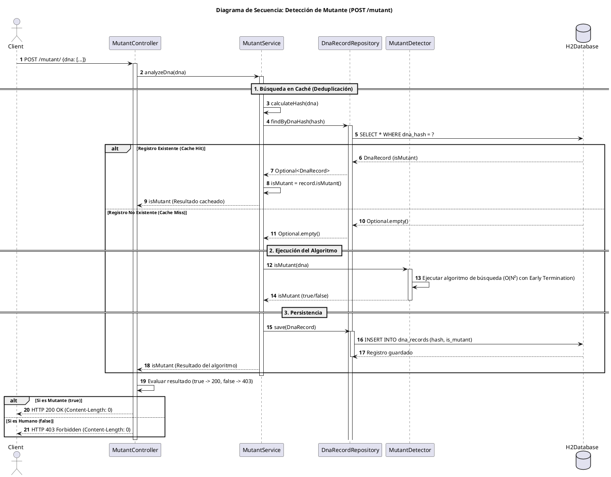

# 🧬 Mutant Detector API - Examen Técnico MercadoLibre

[](https://www.oracle.com/java/)
[](https://spring.io/projects/spring-boot)
[](https://gradle.org/)
[]()
[]()

> 📚 **Proyecto Integrador**: API RESTful que implementa un sistema para detectar si una persona es mutante analizando su secuencia de ADN (matriz NxN de A, T, C, G). El proyecto prioriza la **optimización algorítmica** y la **calidad del código**, cumpliendo con los Niveles 1, 2 y 3 del desafío.

---

## 📋 Tabla de Contenidos

1. [Prerequisitos](#-prerequisitos)
2. [Instalación y Ejecución](#-instalación-y-ejecución)
3. [API Endpoints](#-api-endpoints)
4. [Arquitectura y Optimización](#-arquitectura-y-optimización)
5. [Testing y Cobertura](#-testing-y-cobertura)
6. [Diagrama de Secuencia](#-diagrama-de-secuencia)

---

## 📦 Prerequisitos

Asegúrate de tener instalado el siguiente software:

* **Java JDK:** Versión 17 o superior.
* **Git:** Para clonar el repositorio.
* **Gradle:** (Opcional, incluido con el wrapper `./gradlew`).
* **Postman o Swagger:** Para probar los endpoints.

---

## 🚀 Instalación y Ejecución

La aplicación utiliza **Spring Boot 3** y **Gradle**. La base de datos H2 se inicializa en memoria al inicio de la aplicación.

### Paso 1: Clonar el Repositorio

```bash
git clone [https://github.com/talaverano1/mutantes](https://github.com/talaverano1/mutantes)
cd mutantes
```

### Paso 2: Compilar, Testear e Instalar

Ejecuta el siguiente comando para compilar el proyecto, ejecutar toda la suite de tests y generar los artefactos:

```bash
# Ejecutar tests y compilar
./gradlew clean build
```

### Paso 3: Iniciar la Aplicación

Esto levanta el servidor Tomcat embebido y la API REST en el puerto 8080.

```bash
./gradlew bootRun
```

**Verificación:** La API estará corriendo en `http://localhost:8080`.

### Paso 4: Acceder a las Herramientas

| Herramienta | URL | Propósito |
| :--- | :--- | :--- |
| **Swagger UI** | `http://localhost:8080/swagger-ui.html` | Documentación interactiva de la API (esencial para la evaluación automática). |
| **H2 Console** | `http://localhost:8080/h2-console` | Acceso a la base de datos de persistencia (JDBC URL: `jdbc:h2:mem:testdb`). |

---

## 🌐 API Endpoints

Los endpoints cumplen con el contrato definido en las consignas.

### 1. `POST /mutant` - Detección de Mutantes

Verifica si un ADN es mutante y persiste el resultado.

| Código HTTP | Descripción |
| :--- | :--- |
| **200 OK** | El ADN pertenece a un mutante. |
| **403 Forbidden** | El ADN pertenece a un humano. |
| **400 Bad Request** | La matriz es inválida (no es NxN, tamaño incorrecto o caracteres no permitidos). |

**Ejemplo de Request:**

```json
{
  "dna": [
    "ATGCGA",
    "CAGTGC",
    "TTATGT",
    "AGAAGG",
    "CCCCTA",
    "TCACTG"
  ]
}
```

### 2. `GET /stats` - Obtener Estadísticas

Expone el resultado de las verificaciones almacenadas en la base de datos.

**Ejemplo de Response (200 OK):**

```json
{
  "count_mutant_dna": 40,
  "count_human_dna": 100,
  "ratio": 0.4
}
```

---

## 🏗️ Arquitectura y Optimización

El proyecto está construido bajo una **Arquitectura en Capas** con enfoque en la eficiencia.

### 1. Eficiencia Algorítmica
El algoritmo (`MutantDetector.java`) está diseñado para el mejor rendimiento posible:
* **Early Termination:** La búsqueda se detiene inmediatamente al encontrar la segunda secuencia mutante.
* **Complejidad:** O(N) en el caso promedio gracias a las optimizaciones.

### 2. Persistencia y Deduplicación
Se utiliza una estrategia de **caché** en la base de datos:
* **Hash SHA-256:** Se calcula el hash del ADN antes de la consulta.
* **Deduplicación:** Se usa la consulta por hash (`findByDnaHash`) con un índice `unique = true` para garantizar que solo exista un registro por ADN y evitar el reprocesamiento.

---

## 🧪 Testing y Cobertura

El proyecto cumple con la exigencia de automatización de pruebas y cobertura de código.

* **Tests Totales:** 35 tests (Unitarios y de Integración).
* **Code Coverage:** **86%** de cobertura total (Superando el requisito mínimo de 80%).
* **Verificación:** La suite de tests asegura la funcionalidad del algoritmo, la lógica de caché y las respuestas HTTP del controlador.

### Comandos de Testing

```bash
# Ejecutar todos los tests
./gradlew test

# Ejecutar tests y generar reporte de cobertura JaCoCo
./gradlew clean test jacocoTestReport
```

*El reporte de cobertura se encuentra en: `build/reports/jacoco/test/html/index.html`.*

---

## 📐 Diagrama de Secuencia

El siguiente diagrama ilustra el flujo lógico para la detección de mutantes, incluyendo la capa de optimización (Caché/Hash) y persistencia.


